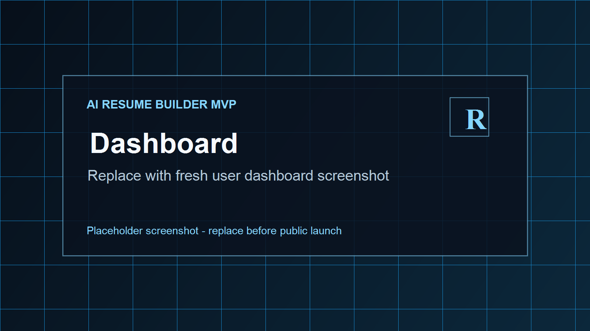
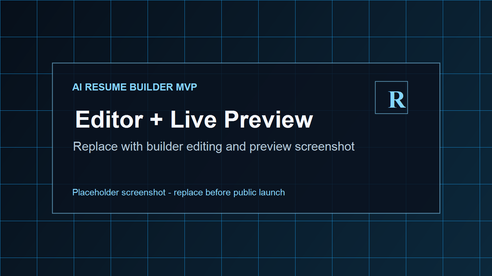
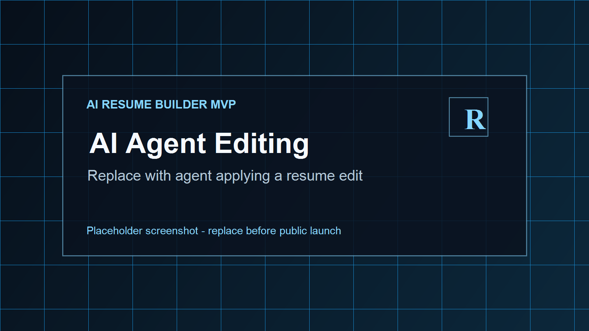
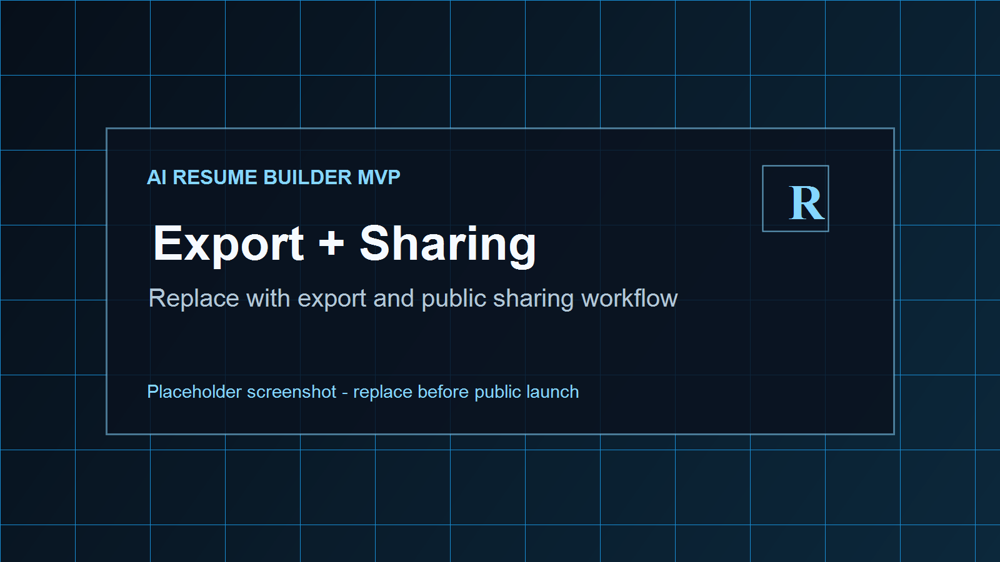
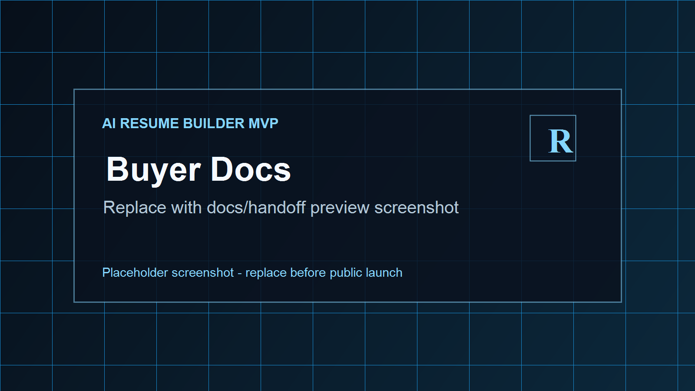

# AI Resume Builder MVP Codebase

Buyer-facing public showcase for a private, paid MVP codebase.

This repository is not the product download. It is a transparent proof page for technical buyers who want to evaluate the product scope before purchasing access to the full source package.

## What This Product Is

**AI Resume Builder MVP Codebase** is a full-stack resume builder foundation with live resume editing, AI-assisted resume edits, auth, dashboard flows, resume preview, export workflows, public sharing controls, and buyer-ready setup documentation.

It is designed for buyers who want a serious starting point for an AI career-tools product, resume SaaS, agency MVP, or internal resume platform without building the first version from scratch.

## Buy The Codebase

Gumroad link:

```text
TODO: Add Gumroad product URL here.
```

Suggested product title:

```text
AI Resume Builder MVP Codebase - Resume Editor, AI Agent, Auth, Preview, Exports
```

## Demo Video

Demo testing showcase:

[Watch the Descript demo testing showcase](https://share.descript.com/view/SJGbJ0Qe9nS)

See [demo/demo-video.md](./demo/demo-video.md) for the demo outline and final launch notes.

## Screenshots

Replace these placeholder images with real screenshots before launch.

| Area | Preview |
| --- | --- |
| Homepage |  |
| Dashboard |  |
| Live editor and preview |  |
| AI agent editing |  |
| Export and sharing |  |
| Buyer docs |  |

## Feature Highlights

- Premium landing page, auth pages, dashboard, and resume builder UI.
- Local email/password auth with optional OAuth provider configuration.
- Resume dashboard with create, import, edit, duplicate, and resume-card workflows.
- Live resume editor with sections for basics, summary, experience, education, skills, and custom content.
- Resume preview with template, design, typography, and layout controls.
- JSON, DOCX, and PDF export flows.
- Public resume sharing controls with privacy-oriented copy.
- AI provider setup with buyer-owned API keys.
- AI resume agent that can propose and apply structured resume edits.
- Documented local development workflow in the paid package.
- Buyer-facing documentation for setup, AI configuration, rebranding, demo, handoff, and limitations.

Read the full feature preview: [docs/features.md](./docs/features.md)

## Tech Stack Preview

- TypeScript monorepo
- React / TanStack Start / Vite
- PostgreSQL with Drizzle
- Redis for AI agent state
- S3-compatible storage support
- Better Auth
- AI SDK provider integrations
- Vitest, Testing Library, Biome, and GitHub CI

Read more: [docs/tech-stack.md](./docs/tech-stack.md)

## What Buyers Receive

The paid package includes the private source code and buyer handoff documentation. This public showcase only includes product description, screenshots, FAQ, limitations, and preview docs.

Private package highlights:

- Full application source code
- Sanitized environment template
- Local development setup guide
- Setup and configuration docs
- AI provider setup docs
- Demo script
- Deployment notes
- Rebranding notes
- Known limitations
- Non-exclusive commercial license summary

See [docs/buyer-handoff-preview.md](./docs/buyer-handoff-preview.md).

## License Summary

The intended sale is a **non-exclusive commercial codebase license**.

In plain English:

- Buyer may use, modify, rebrand, and deploy the codebase for one commercial product.
- Buyer may not resell, redistribute, sublicense, or publish the source code as a template/codebase.
- Buyer may not claim exclusive ownership of the original codebase.
- Seller retains the right to keep using, modifying, and selling the codebase.
- Buyer must use their own API keys, hosting, domain, storage, email, and payment accounts.

Read [LICENSE_SUMMARY.md](./LICENSE_SUMMARY.md). This is not legal advice.

## Honest MVP Notes

This is an MVP codebase, not a fully managed production SaaS. Buyers should validate production hosting, secrets, backups, monitoring, billing, legal policies, and compliance before serving real users.

Read [KNOWN_LIMITATIONS.md](./KNOWN_LIMITATIONS.md) before purchase.

## FAQ

Common buyer questions are answered in [FAQ.md](./FAQ.md).

## Recommended GitHub Repo Settings

Recommended public repo name:

```text
ai-resume-builder-mvp
```

Alternative:

```text
ai-resume-builder-mvp-showcase
```

Recommended GitHub description:

```text
AI resume builder MVP codebase with live resume editing, AI agent edits, auth, dashboard, preview, exports, and SaaS-ready buyer docs.
```

Recommended topics:

```text
ai-resume-builder, resume-builder, ai-saas, mvp-codebase, react, typescript, postgres, ai-agent, gumroad
```

## Support Expectations

Unless a separate support package is purchased, the sale includes source code and documentation only. Setup help, deployment, custom rebranding, production hardening, and feature work should be priced separately.
